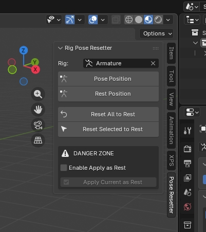

# Rig Pose Resetter

A simple Blender addon that adds a panel with buttons in the sidebar (N key) in the **Pose Resetter** tab.

The main reason this addon was made - you can select the desired rig in a dropdown menu in advance, and then work with the buttons — no need to reselect it or switch modes every time.

## Features & Buttons:
- **Toggle Bone Visibility** — Quick access to show/hide bones in the viewport.
- **Target Rig Selector** — Choose your armature.
- **Select & Pose** — Instantly selects the target rig and switches to Pose Mode.
- **Pose All Visible** — Automatically selects all visible armatures in the scene and puts them into Pose Mode.
- **Pose Position / Rest Position** — toggle pose display mode (similar to buttons in Armature Data Properties).
- **Reset Selected / All to Rest** — Quickly reset bone transformations (Alt+G / Alt+R / Alt+S) for selected or all bones.

## Installation
1. Download the ZIP archive.
2. Blender 4.2+: `Edit` -> `Preferences` -> `Add-ons` -> `Install from Disk...` -> select the ZIP.  
   Or simply drag the archive into the Blender window.
3. Enjoy.
